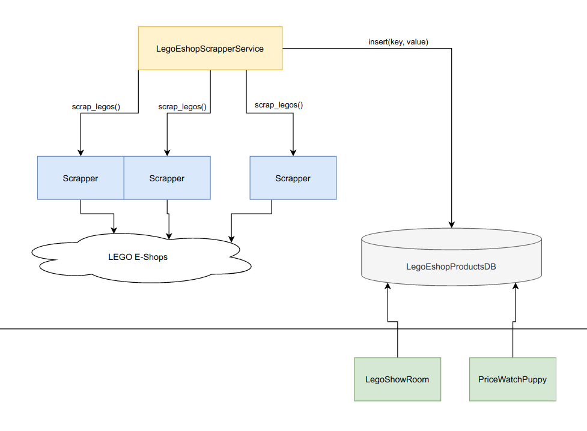

# Cloud City
**Cloud City** is **LEGO Star Wars search engine & price watcher** working on Czech e-shops. 
Purpose for this application is to provide automated tools for anything true LEGO Star Wars fan might need for their
galactic passion.

# Disclaimer
The project is open source developed under Apache License 2.0. 
It is not developed with commercial intentions. 
I am in no way affiliated with LEGO or Star Wars brands nor companies.

For more information about **LEGO** visit: https://www.lego.com/en-us

For more information about **Star Wars** visit: https://www.starwars.com/

# Development guide
## System architecture
### Data ingestion 
Data ingestion is handled by LegoEshopScrapperService which periodically
activates Scrapper for each individual e-shop. These return list of JSON formatted 
lists of LEGO sets with fields such as name, price, etc... This data is stored
in a key/value store where it can be accessed by other services.
